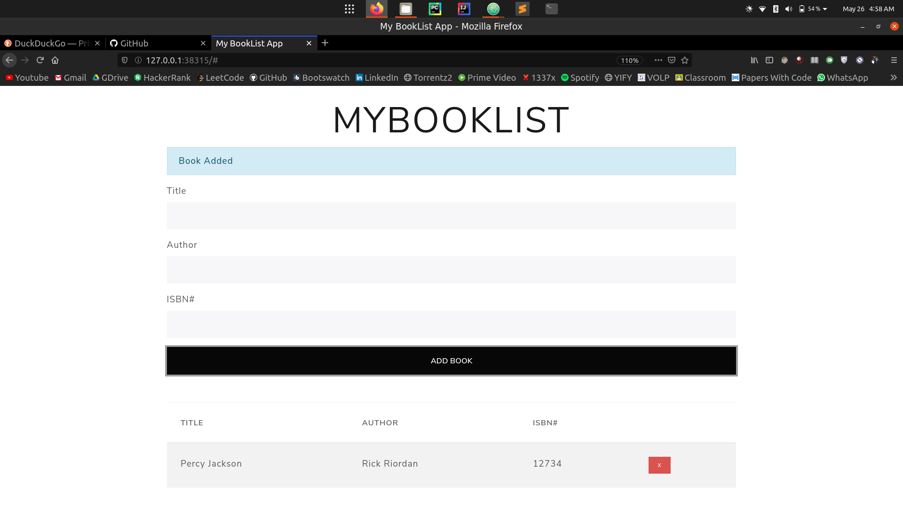
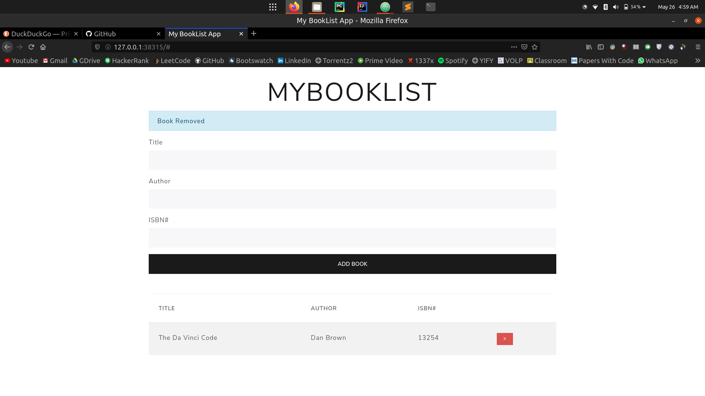
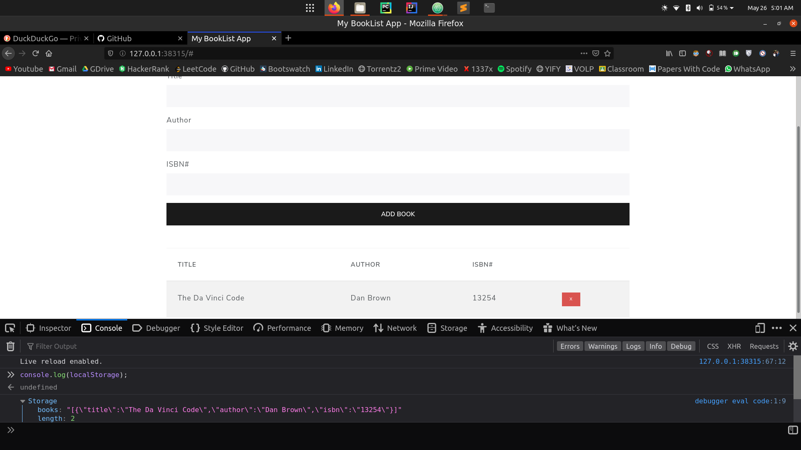

# Book-List-App
This is a basic BookList App created using Vanilla Javascript. No Frameworks used.

#### The above code is deployed at [this link](https://mybooklistmanager.netlify.app/)

## Screenshots

## Getting Started
Download/Clone the files from GitHub to your desired directory on your desktop.

### Prerequisites
Web Browser like Chrome/Firefox/Edge/Internet Explorer

### Run the program
Open the index.html file using your preferred browser like Chrome/Firefox/Edge.

## Built With

* [JavaScript](https://www.javascript.com/)
* [HTML5](https://html.com/)

## Acknowledgements

* Brad Traversy Vanilla JS Tutorials on Youtube

